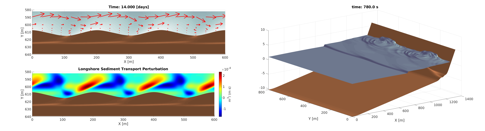

# :ocean: Morfo70

#### Morfo70 is a numerical code for simulating 2DH beach morphodynamics in the surf-zone and shoreline dynamics. It provides description of wave transformation from deep water to beach, rollers formation and propagation, wave-currents, sediment movement, morphological evolution, also it includes the effect of tides and swash flooding.




# :computer: Compile Code

### 1. Pre-requisites:
Please ensure you have [netcdf-4](https://www.unidata.ucar.edu/software/netcdf/) and  [Hdf5](https://www.hdfgroup.org/solutions/hdf5) libraries installed. For general linux distributions:
```bash
sudo apt-get install libnetcdf-dev
```
In order to run in parallel mode, ensure that your compiler has __*openMP*__  capabilities.


#### 2. Compilation using [compile.sh](compile.sh) script:
```bash
sh compile.sh gcc release nomp
```
The first parameter `gcc` is the compiler command, the second parameter `release | debug` is the binary target, and the third `omp | nomp` enables (or no) shared memory parallelization.


## :arrow_forward: Run Morfo70:
For running Morfo70:
```bash
./bin/morfo70_gcc -ind=Input_Folder -inif=INI_File1[,INI_File2,...] -batf=Bathymetry_File -outd=Ouput_Folder
```
Where:
* __Input_Folder:__ Is the path to the input folder containing bathymetry and *.ini* files

* __INI_File$:__ Is the *.ini* file with model input, options and parameters. A self-descriptive template file is located [here](test/input/case.ini). If more than one file is provides, the program read  them sequentially from left to right.

* __Bathymetry:__ Is the *.nc* bathymetry file (in netcdf format), which contains *x*, *y*, *Z*  and *h* vars. Bathymetry example [here](test/input/beach_cb_nowall.nc).

* __Output Folder:__ Is the destination folder where model results are stored in netcdf format. For displaying output files,  applications such as [ncBrowse](https://www.pmel.noaa.gov/epic/java/ncBrowse/) can be used.

An execution example of an hydrodynamic simulation of a crescentic bar system is given by:
```bash
./bin/morfo70_gcc -ind=test/input -inif=base_case.ini -batf=beach_cb_wall.nc -outd=test/output
```

## :bookmark_tabs: Code Structure
Folder `src` contains `*.cpp` C++ source files and `include`  folder the headers. The main function is located in [main.cpp](src/main.cpp)  and the execution loop is coded in [Morfo70.cpp](include/Morfo70.h). 

[Wave](include/Wave.h) and  [WaveRow](include/WaveRow.h) classes stores wave field and performs wave transformations. [Hydro](include/Hydro.h) class solves non linear shallow water equations in order to calculate wave currents an free surface. [Sediment](include/Sediment.h) class computes sediment fluxes and update  beach bottom. [Grid](include/Grid.h) and [Bathymetry](include/Bathymetry.h) classes provides functionality to handle the computational mesh and the domain bathymetry.

## :pencil2: Documentation

Governing Equations, numerical scheme detailes description and used parametrizations are described in the following [technical report](docs/Morfo70_equations.pdf)